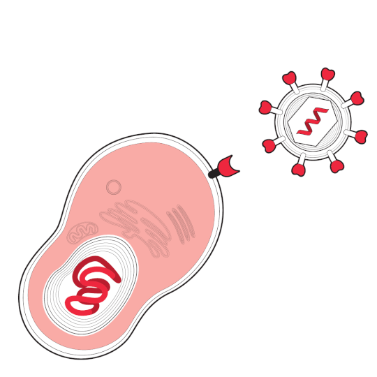

# BT302-Project-Work

## Background

* Studies on host-pathogen interaction have identified human ACE2 (Angiotensin Converting Enzyme 2) as a host cell receptor responsible for mediating infection by coronavirus (SARS-CoV-2).

* Viral spike glycoprotein (S) binds to the ACE2 receptor to initiate viral RNA replication inside the host body.

* TMPRSS2 gene codes a protease Transmembrane Serine Protease 2 (TMPRSS2) which cleaves the viral spike protein and thus helps in viral entry inside the host. 
  This is known as S protein priming.

* By examining the expression patterns of these two genes we can elucidate the viral response pattern on certain human tissues and organs. 

     

***Figure 1.***  *Depiction of cell surface receptor and protease activity for SARS-CoV-2 entry inside host cell*  [**[1](https://www.invivogen.com/ace2-and-tmprss2-expression-vectors)**]  

***Figure 2***. (A) *Spike proteins on the surface of the coronavirus bind to angiotensin-converting enzyme 2 (ACE-2) receptors on the surface of the target cell; (B) The type II transmembrane serine protease (TMPRSS2) binds to and cleaves the ACE-2 receptor. In the process, the spike protein is activated; (C) Cleaved ACE-2 and activated spike protein facilitate viral entry. TMPRSS2 expression increases cellular uptake of the coronavirus* [**[2](https://www.mdpi.com/2076-0817/9/3/231/htm#)**]

**Datasets used:**

1. **[Human Lung epithelial dataset](https://drive.google.com/drive/folders/10l_4KD2eMq3lP0Du29XjJ9g0KJCE7fB2)**
2. **[Nasal Mucosa dataset](https://drive.google.com/drive/folders/10l_4KD2eMq3lP0Du29XjJ9g0KJCE7fB2)**
3. **[NHP lung epithelial dataset](https://drive.google.com/drive/folders/10l_4KD2eMq3lP0Du29XjJ9g0KJCE7fB2)**
4. **[NHP ileum epithelial dataset](https://drive.google.com/drive/folders/10l_4KD2eMq3lP0Du29XjJ9g0KJCE7fB2)**

**Some insights related to these datasets**

Dataset | Total cells | Total genes
| :--- | ---: | :---:
Human Lung epithelial | 1001 | 22560
Nasal Mucosa | 8312 | 24837
NHP lung epithelial | 477  | 25376
NHP ileum epithelial | 1214 | 24945

## UMAP of ACE2 & TMPRSS2 gene expression profiles 

### For Human Lung epithelial dataset

    

### For  Nasal Mucosa dataset

    

### For  NHP lung epithelial dataset

    

### For  NHP ileum epithelial dataset

   

### Violin plot showing gene expression profile of ACE2 & TMPRSS2 genes for Human Lung Epithelial dataset in different clusters

### Violin plot showing gene expression profile of ACE2 & TMPRSS2 genes for Nasal Mucosa dataset in different clusters

### Violin plot showing gene expression profile of ACE2 & TMPRSS2 genes for NHP Lung Epithelial dataset in different clusters

### Violin plot showing gene expression profile of ACE2 & TMPRSS2 genes for NHP Ileum Epithelial dataset in different clusters

Reference 
[Shalek Lab Alexandria Project](http://shaleklab.com/resource/covid-19-resources/)

